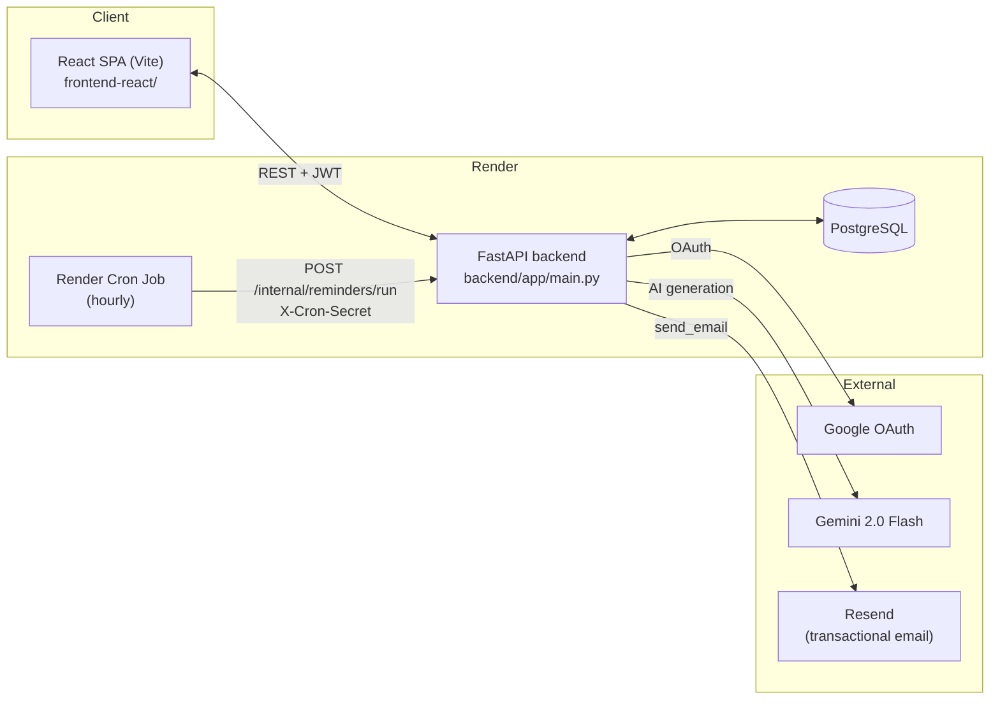

# DailyCode — Architecture

This document explains the *why* behind DailyCode's design — the daily-rotation algorithm, the theme engine, the database schema, the reminder/recommendation architecture, and the security/performance decisions made along the way. See the main [`Readme.md`](../Readme.md) for setup and a feature overview.

## Contents
- [System Overview](#system-overview)
- [The Daily Rotation Engine](#the-daily-rotation-engine)
- [The Multi-Theme System](#the-multi-theme-system)
- [Component Library Decisions](#component-library-decisions)
- [Database Schema](#database-schema)
- [Onboarding & Personalization](#onboarding--personalization)
- [Reminders: Scheduling Architecture](#reminders-scheduling-architecture)
- [Analytics: What's Actually Measured](#analytics-whats-actually-measured)
- [Recommendations: v1 → v2](#recommendations-v1--v2)
- [Security](#security)
- [Performance](#performance)
- [Retrieval-Augmented Generation](#retrieval-augmented-generation)
- [Known Limitations & Roadmap to v2.0](#known-limitations--roadmap-to-v20)

---

## System Overview



The frontend never talks to Postgres, Google, Gemini, or Resend directly — everything goes through the FastAPI backend, which is the single source of truth for auth, rate-relevant logic, and the shared daily rotation. The only thing that reaches the backend without a user session is the Cron Job, gated by a shared secret instead of a JWT.

---

## The Daily Rotation Engine

**Requirement:** every user sees the *same* snippet on a given UTC day, it changes once a day, it cycles through every public snippet before repeating, new public snippets join automatically, deleted ones drop out automatically, and none of it uses `random()`.

```python
def _compute_rotation_snippet(db, today):
    total = db.query(func.count(Snippet.id)).filter(Snippet.is_public == True).scalar()
    offset = today.toordinal() % total
    return (
        db.query(Snippet)
        .filter(Snippet.is_public == True)
        .order_by(Snippet.id.asc())
        .offset(offset)
        .limit(1)
        .first()
    )
```

Why this shape, specifically:

- **Ordering by `id ASC`, not a random shuffle** — `id` is already a stable, monotonically increasing sequence. A newly-added public snippet always gets the *highest* id, so it's appended to the end of the rotation without shifting anyone else's day. No separate "rotation position" column to maintain.
- **`is_public` in the `WHERE` clause** — a snippet made private or deleted simply stops appearing in the ordered set; the offset naturally recalculates around the gap on the *next* day. (Today's already-pinned pick, see below, isn't retroactively changed if this happens mid-day — see the self-heal note.)
- **`day.toordinal() % total`** — a pure function of (day, total count). Same inputs, same output, forever. That's what makes caching it safe (next point) and testable (no wall-clock mocking needed beyond the date itself).
- **Composite index `ix_snippets_public_id (is_public, id)`** — keeps both the `COUNT` and the `OFFSET ... LIMIT 1` an index scan instead of a full table scan as the table grows into the thousands. Declared in `models.py` for fresh databases; backfilled on existing ones via an idempotent `CREATE INDEX IF NOT EXISTS` in `connect_with_retry()` (works on both Postgres and SQLite, unlike `ADD COLUMN IF NOT EXISTS` which SQLite doesn't support).

### The pin cache

Computing the offset is cheap, but it still touches the database on every request. Since the *result* is identical for every user on a given day, it's cached in a dedicated table:

```
daily_snippets (day TEXT UNIQUE, snippet_id FK → snippets.id ON DELETE SET NULL)
```

`GET /snippets/daily` checks this table first. Cache hit → one indexed lookup on `day`, done. Cache miss (first request of the UTC day, or the previously-pinned snippet was deleted/unpublished since) → compute, write the pin, return. This means **only the very first request each day pays the computation cost** — every other user, every other request, all day, is a single primary-key-adjacent lookup, regardless of how many thousands of public snippets exist.

Concurrency: two requests racing to be "first" on a new day both compute the *same* result (pure function), so if both try to insert the pin, the loser just hits a unique-constraint violation, rolls back, and moves on — no lock needed, no incorrect data possible.

---

## The Multi-Theme System

Every visual property in the app — background, card surface, text, border, shadow, and even syntax-highlighting colors — is a CSS custom property, consumed by Tailwind utility classes (`bg-card`, `text-muted`, `border-border-card`) rather than hardcoded anywhere in component code. That single decision is what makes 6 full themes possible without 6 versions of every component.

### Mechanism

```html
<html data-theme="midnight">  <!-- or solar / forest / lavender / ocean / paper -->
```

`index.css` defines one `:root` block (Midnight, doubling as the default) and five `[data-theme="…"]` override blocks, all defining the *exact same* variable names. `ThemeContext` just swaps the attribute and persists the choice to `localStorage`. An inline script in `index.html` sets the attribute *before* React even mounts, so there's no flash of the wrong theme on load.

**Smooth switching, for free:** index.css already had a blanket `transition-property: background-color, border-color, color, box-shadow` rule on every element (originally there to make the light/dark toggle less jarring). Once themes stopped suppressing that transition, switching themes cross-fades every color on screen automatically — no custom wipe/reveal animation needed.

### The 6 palettes

| Theme | Mode | Primary accent | Personality |
| :--- | :--- | :--- | :--- |
| 🌙 Midnight | Dark | `#00d4ff` (cyan) | The original app's brand color, evolved toward true AMOLED black — kept deliberately, not sanitized, since it predates the redesign |
| ☀️ Solar | Light | `#e8863a` (soft orange) | Warm cream, low blue-light, for long reading sessions |
| 🌿 Forest | Dark | `#34d399` (emerald) | Cozy "focus mode" green |
| 💜 Lavender | Light | `#8b5cf6` (violet) | Soft purple, elegant pink accent |
| 🌊 Ocean | Dark | `#2b8ca6` (muted teal-blue) | Deliberately *not* `#3b82f6` (Tailwind's stock `blue-500`) — an earlier pass used it and it read as generic-template blue, so it was replaced with something calmer and more intentional |
| 🤍 Paper | Light | `#0077aa` (ink blue) | ≈ the original light theme, kept close to it for continuity |

Derived values (subtle/glow/hover-alpha variants) follow one mechanical rule per theme: `-subtle` ≈ 8–10% alpha of the primary color, `-glow` ≈ 18%, `-glow-lg` ≈ 28–35%, `border-hover` ≈ 20–25%. Consistent across all 6, not hand-tuned per theme.

### Syntax highlighting

Prism.js's usual approach is importing one fixed vendor theme (e.g. `prism-tomorrow.css`), which stays visually frozen regardless of the app's theme. Instead, `styles/prism-theme.css` maps Prism's token classes (`.token.keyword`, `.token.string`, etc.) to `--syntax-*` custom properties, defined per-theme alongside everything else — so code blocks re-theme along with the rest of the UI. Code blocks intentionally stay on a near-black background in *every* theme (including the light ones), matching the universal syntax-highlighting convention rather than trying to make dark-text-on-light-background code readable across 6 arbitrary accent hues.

---

## Component Library Decisions

- **Headless UI over hand-rolled dropdowns/dialogs/radio groups**: `Dialog`, `Combobox` (backing the searchable `Select`), `RadioGroup`, `Switch`, `Tabs` all come from `@headlessui/react` rather than custom-built. Reason: correct ARIA roles, focus-trapping, and keyboard navigation (Escape, Tab, arrow keys) are notoriously easy to get subtly wrong by hand, and Headless UI ships zero default visual styling — so it doesn't fight the "unique visual identity" goal at all, it's purely a behavior layer underneath Tailwind classes.
- **Framer Motion for micro-interactions only**: button press feedback, dialog/drawer enter-exit, theme-selection confirmation. Deliberately *not* used for page-level "hero" animations or decorative background effects — an earlier draft of the login page had an animated gradient wash and marketing-style copy; both were removed in favor of showing the actual product (a live rendering of today's snippet) instead of describing it.
- **Hand-built bar charts, not a charting library**: the Analytics page's weekly/monthly activity and category-distribution visualizations are plain divs with height/width percentages, matching the same visual language as the existing activity heatmap — not recharts/Chart.js. A generic charting library's default look reads as "another admin dashboard template"; the goal throughout this redesign was the opposite (see the product-philosophy notes in the onboarding flow's design below).
- **`StatCard` is shared, not duplicated** — originally written once inline in `Dashboard.jsx`, extracted to `components/ui/StatCard.jsx` the moment a second consumer (`Analytics.jsx`) needed the identical count-up-animated tile.

---

## Database Schema

```mermaid
erDiagram
    USERS ||--o{ SNIPPETS : owns
    USERS ||--o{ FAVORITES : has
    USERS ||--o{ ACTIVITIES : generates
    USERS ||--o| REMINDER_SETTINGS : configures
    USERS }o--o{ TOPICS : selects
    SNIPPETS }o--o{ TAGS : tagged_with
    SNIPPETS ||--o{ FAVORITES : favorited_as
    SNIPPETS ||--o{ DAILY_SNIPPETS : pinned_as
    SNIPPETS ||--o{ SNIPPET_EMBEDDINGS : indexed_as

    USERS {
        int id PK
        string email UK
        string hashed_password "nullable — Google-only accounts"
        string google_id "nullable"
        bool is_active
        datetime created_at
        datetime welcome_email_sent_at "nullable — idempotency guard"
        bool onboarding_completed
    }
    SNIPPETS {
        int id PK
        string title
        string language
        text code
        text explanation
        bool is_public
        string difficulty
        string category
        datetime created_at
        int owner_id FK "nullable — system-seeded snippets"
    }
    SNIPPET_EMBEDDINGS {
        int id PK
        int snippet_id FK "ON DELETE CASCADE"
        text chunk_text
        int chunk_index "unique per snippet"
        string embedding_model
        vector embedding "384 dimensions"
        datetime created_at
    }
    TAGS {
        int id PK
        string name UK
    }
    TOPICS {
        int id PK
        string name UK
        string slug UK
    }
    REMINDER_SETTINGS {
        int user_id PK_FK
        string frequency "none | daily_morning | daily_afternoon | daily_evening | weekly_summary"
        string timezone "IANA name, e.g. Asia/Kolkata"
        datetime updated_at
    }
    FAVORITES {
        int id PK
        int user_id FK
        int snippet_id FK
        datetime created_at
    }
    DAILY_SNIPPETS {
        int id PK
        string day UK "YYYY-MM-DD, UTC"
        int snippet_id FK "ON DELETE SET NULL"
    }
    ACTIVITIES {
        int id PK
        string action "favorited snippet | viewed_daily_snippet"
        int snippet_id "no FK — see note below"
        int user_id FK
        datetime timestamp
    }
```

Deliberate design choices worth calling out:

- **`activities` is a generic event log, reused, not duplicated.** It originally only logged `"favorited snippet"` (for the heatmap). Rather than build a parallel `LearningHistory` table when personalization features needed "did this user actually read today's snippet," a second `action` value (`"viewed_daily_snippet"`) was added instead. This is what makes `/heatmap/me` and `/analytics/me` reflect real reading, not just favoriting — with zero new tables.
- **`topics` is intentionally separate from `tags`.** Tags are freeform, per-snippet labels (`"hashmap"`, `"leetcode"`) created ad hoc by whoever adds a snippet. Topics are a small, curated, fixed taxonomy (22 items) used only for onboarding/personalization. Conflating them would mean either polluting the tag list with onboarding-only concepts or vice versa.
- **No `EmailPreferences` table.** There is currently exactly one opt-in email type (reminders), and `reminder_settings.frequency = "none"` already fully expresses "stop emailing me." A dedicated preferences table becomes worth its cost the moment a *second* email type exists (e.g. product announcements) — until then it would be an empty abstraction.
- **No `recommendations` table (yet).** See [Recommendations: v1 → v2](#recommendations-v1--v2) below for exactly when and why one gets added.
- **`daily_snippets.snippet_id` is `ON DELETE SET NULL`**, not `CASCADE` or unconstrained — deleting today's pinned snippet nulls the pin rather than either blocking the delete or leaving a dangling foreign key; the next request to `/snippets/daily` recomputes and re-pins automatically.
- **Snippet embeddings live in their own `snippet_embeddings` table**, with one row per text chunk and an HNSW index using pgvector's cosine operator class. The 384 dimensions match `BAAI/bge-small-en-v1.5`. The app's `create_all()` startup path deliberately excludes this table: the Alembic migration enables the `vector` extension and creates the table/index, so production schema changes are explicit and versioned. Locally, start the database and backend first (`docker compose up -d db backend` from `backend/`) so the existing application initializes its base tables; then run `docker compose exec backend alembic upgrade head`. Downgrading drops the embedding table but leaves the shared PostgreSQL extension installed.

---

## Onboarding & Personalization

Two-step wizard, shown once, gated by `users.onboarding_completed`:

1. **Topics** — multi-select from the 22 curated topics (reuses the same pill/chip component as Home's tag filter).
2. **Reminders** — a `RadioGroup` of 5 frequency options, defaulting to "No reminders" (never defaults to an active reminder — it's opt-in or nothing). The browser's IANA timezone (`Intl.DateTimeFormat().resolvedOptions().timeZone`) is captured automatically here — no manual timezone picker.

Both steps are skippable. The gate itself lives in `AuthContext.redirectAfterAuth()`: after any successful login (email/password or the Google OAuth token handoff), it calls `GET /users/me` and routes to `/onboarding` or `/` based on the flag — fails open to `/` if the check itself errors, since onboarding exists to reduce friction, not to become a single point of failure blocking access to an app the user already successfully authenticated into.

Both the wizard and the equivalent Settings-page controls call the *same* backend endpoints (`/users/me/topics`, `/users/me/reminders`), which are set-replace, not append — resubmitting the same selection twice (e.g. a retried request) can't produce duplicate rows or drift the stored state.

---

## Reminders: Scheduling Architecture

Render's free web-service tier has no persistent worker process, and in-process schedulers (APScheduler, etc.) are unreliable there specifically because free instances spin down when idle — a scheduled job simply doesn't fire if the instance isn't awake at that moment. Rather than build around that unreliability, the chosen architecture treats time-based triggering as an *external* concern:

```
Render Cron Job (hourly) --POST /internal/reminders/run, X-Cron-Secret header--> FastAPI
```

The endpoint itself is a pure function of "what time is it right now, everywhere":

1. For every user with a non-`"none"` reminder frequency, convert "now" to *their* timezone (`zoneinfo.ZoneInfo(user_timezone)`).
2. Check whether their local hour matches their chosen window (morning ≈ 8am, afternoon ≈ 2pm, evening ≈ 7pm local; weekly summary ≈ Monday 8am local).
3. Queue a `send_email()` background task for each match.

Because this runs once an hour and each user matches at most one hour a day (or one hour a week), there's no separate "already sent today" dedupe table — a cron double-fire within the same hour would double-send, which is an accepted v1 simplification, not an oversight. A genuinely important bug *was* caught and fixed here, though: `zoneinfo` has no built-in timezone database on Windows (and some minimal Linux images), so `ZoneInfo("Asia/Kolkata")` would silently raise and — inside an overly broad `except Exception` — fall back to UTC with zero visibility that anything had gone wrong. Fixed by adding the `tzdata` package (Python's official recommendation for exactly this situation) and by logging the failure instead of silently swallowing it.

---

## Analytics: What's Actually Measured

`GET /analytics/me` is built entirely from data that already exists — no new tracking beyond the `viewed_daily_snippet` activity event described above:

| Metric | How it's derived |
| :--- | :--- |
| Current / longest streak | Same day-by-day walk as `/heatmap/me`, now sourced from real-read events instead of only favorites |
| Snippets completed | Distinct `snippet_id`s across `viewed_daily_snippet` activities |
| Category distribution / favorite category | Group the viewed snippets' `category` field |
| Average learning time | Sum of each viewed snippet's `reading_time_minutes` (already a computed property — word count ÷ ~130 wpm), **not** real elapsed-time tracking. Deliberate: session-duration tracking (tab focus/blur, beacon pings) is fragile and easy to get wrong for marginal accuracy gain over a reasonable proxy |
| Reading consistency % | `active_days ÷ days_since_signup`, capped at 100%. Users who predate the `created_at` column (added mid-project) fall back to treating the full 365-day window as their tenure, rather than dividing by zero or overstating consistency for an unknown actual signup date |
| Weekly / monthly activity, trend | Simple grouping/bucketing of the same activity rows; trend compares the most recent 2 weeks against the 2 before that |

Analytics is deliberately a **separate route** (`/analytics`) from the Dashboard, not folded into it. The Dashboard's entire reason to exist is "today's snippet, the hero, right at the top" — turning it into a stats-heavy page would work against that.

---

## Recommendations: v1 → v2

`GET /recommendations/me` (v1, live in this codebase) computes on every request:

```
score = 0
+2  if snippet.language/category/tags match a selected topic
     (direct match, or a small hardcoded alias map for topics like
     "DSA" that don't literally equal any snippet field)
+1  if snippet shares a tag with something the user favorited
exclude: already-viewed snippets, today's rotation pick
```

No `recommendations` table exists yet, deliberately: v1 is cheap enough (a handful of in-memory comparisons over the public snippet set) to compute fresh on every request, which means it's never stale.

**The upgrade path, precisely:** once recommendation generation involves an LLM call, doing that synchronously per page load becomes too slow and too expensive. At that point:
1. Add a `recommendations` table (`user_id, snippet_id, score, reason, generated_at`).
2. Populate it via a nightly batch job — the *same* Render Cron mechanism already built for reminders, just a different endpoint.
3. Change `GET /recommendations/me`'s internals to read from that table instead of computing live.

The response schema (`RecommendationsResponse` / `RecommendedSnippet`) doesn't need to change for this — only what populates it does. The frontend, built against v1's response shape, keeps working untouched when v2 ships.

---

## Security

- **`/internal/reminders/run` never accepts a user JWT** — a separate `X-Cron-Secret` header, checked before any database work, never logged.
- **Email HTML-escaping**: snippet titles/explanations are user-generated (any authenticated user can publish a public snippet, and public snippets are exactly what the daily rotation — and therefore reminder emails — surface). Unlike JSX, an f-string does not auto-escape; `email_templates.py` runs `html.escape()` on both before interpolating them into raw HTML. Skipping this would be a stored-XSS-via-email vector.
- **Password change** verifies the current password via `verify_password()` before allowing a new one, and explicitly rejects Google-only accounts (`hashed_password is None`) with a clear message rather than a confusing generic failure.
- **`GET /snippets/{id}` is public-only by design** — it filters `is_public == True` unconditionally, since its only current caller (recommendation click-through) only ever references public snippet IDs to begin with.
- **CORS allowlist** is explicit (`origins` in `main.py`) — no wildcard origins in production.
- **JWTs** carry `sub` (user id) and `email`; validated via `python-jose` against `JWT_SECRET_KEY` on every authenticated request through the `get_current_user` dependency. A separate `_optional_current_user_id()` helper (used by search and daily-snippet-view-logging) returns `None` on a missing/invalid/expired token instead of raising, for the handful of endpoints that behave differently for logged-in users but must still work for guests.

## Performance

- The rotation engine's pin-cache (above) means the by-far-most-frequent read (`/snippets/daily`) is an indexed lookup, not a computation, for all but the first request of each UTC day.
- View-logging, welcome emails, and reminder sends all run via FastAPI `BackgroundTasks` and are wrapped in try/except that logs-and-continues — none of them can make the triggering request slower or fail because a non-critical side effect (an email, an analytics event) had a problem.
- **Known cost, not yet paid off**: `/recommendations/me` loads every public snippet into Python to score them — the same class of "fetch everything" operation the rotation engine specifically avoided. Acceptable at the current (seed-data) scale; the v2 AI/precomputed-table path (above) naturally resolves this by not doing the work synchronously per request at all.
- Frontend: route-level code splitting (`React.lazy` per page) predates this feature set and still applies to every new page (`Onboarding`, `Settings`, `Analytics`); shared UI primitives and third-party libraries (Framer Motion, Headless UI, lucide-react) are deduplicated by Rollup into shared chunks rather than bundled once per page.

## Retrieval-Augmented Generation

DailyCode's RAG feature stays deliberately small and inspectable: it uses no LangChain or agent framework. The React Home search can switch from keyword matching to semantic retrieval, while the existing Add Snippet AI screen includes an “Ask Library” tab for grounded answers.

```text
React frontend
    ↓
FastAPI API
    ↓
RAG service
    ↓
BAAI/bge-small-en-v1.5 query embedding
    ↓
pgvector cosine retrieval
    ↓
top-k authorized snippets
    ↓
Gemini
    ↓
grounded response
    ↓
React UI
```

`BAAI/bge-small-en-v1.5` is compact enough to run locally and produces useful semantic representations for short code-and-explanation documents. It produces **384-dimensional** normalized vectors, matching the `vector(384)` column in `snippet_embeddings`. PostgreSQL's pgvector extension ranks with cosine distance; `similarity_score` is returned as `1 - cosine_distance`. The HNSW index uses pgvector's `vector_cosine_ops` operator class, so this retrieval shape remains indexed as the library grows.

Privacy is part of the retrieval query, not a post-processing step. For guests, SQL filters to public snippets. For authenticated callers, it filters to `is_public = true OR owner_id = current_user_id` **before** ordering by cosine distance and applying `LIMIT`. Therefore a different user's private content cannot appear in results or enter Gemini's context. Embedding vectors are never returned to the browser.

`GET /snippets/semantic-search` performs retrieval only. Matches must clear a small cosine-similarity floor (`0.35`), so an unrelated query can correctly return no results. `POST /snippets/generate-rag` has three explicit stages: retrieve permitted matches, construct context from only those matches, then ask Gemini to answer from that context. With no retrieved context it does not call Gemini and instead returns a clear grounded-no-context response. Gemini is a generation layer, not the data source of truth.

## Known Limitations & Roadmap to v2.0

1. **Content is thin relative to the topic list.** The 10 seed snippets skew toward general algorithms/JS/Python; several onboarding topics (Docker, AWS, System Design, Kubernetes) have no matching content yet, so recommendations and analytics will look sparse for users interested in those areas until more varied snippets exist.
2. **Pre-migration users have `created_at = NULL`** — there's no way to backfill a real historical signup date for accounts created before that column existed; reading-consistency % falls back to a 365-day assumption for them specifically.
3. **Weekly summary emails currently reuse the daily-reminder template** (today's snippet), not a real week-in-review — building an actual summary (streak, categories, snippets read) is now straightforward since `/analytics/me` exists to source it from, but hasn't been wired up yet.
4. **A cron double-fire within the same hour would double-send a reminder** — no dedupe log exists yet; acceptable at current scale, worth revisiting if it's ever observed in practice.
5. **No automated test suite yet** — everything in this document was verified by direct API calls against a real running backend during development, not by a checked-in test suite. Next up per the project roadmap: bug-fixing pass, performance profiling, and adding real tests before the next round of feature work.
